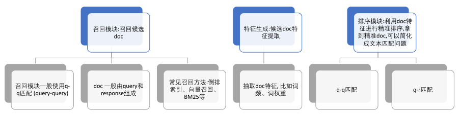
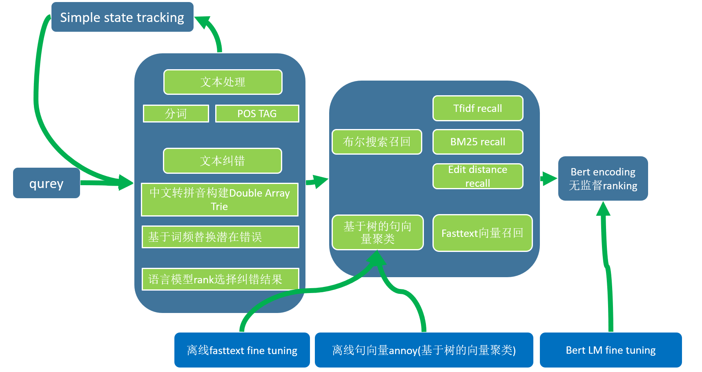

### 问题背景描述

对话机器人的常见的NLP与自然语言处理的应用方向，本项目将使用脱敏的某真实常见下的QA数据集，构造一个用于银行系统的对话机器人。可以处理常见的很多业务，例如开卡，例如挂失补办等等业务。

银行对话机器人用到的这些技术，还可以使用在其他领域，例如保险，理财，购物等等。


### 数据与环境

数据来自某银行常见QA数据集，其中混有部分聊天预料，拿到数据时已经混合了。否则可以分开标记，训练intent classifier加入模型（在[StackOverFlow QA Bot](https://github.com/RacleRay/ChatBot-based-on-xiaohuangji/tree/master/StackOverflow-Assistant)项目中使用的方法）。

环境：python3.6

> ```
> pandas
> numpy
> scipy
> tensorflow-gpu==1.13.1
> flask
> annoy
> gensim
> kenlm
> datrie
> pypinyin
> bert-serving-server
> bert-serving-client
> pyltp
> redis
> pymongo
> ```

[jupyter_notebooks](./jupyter_notebooks)文件夹下为项目创建过程及离线运行的代码和记录。运行在项目根目录下，即需要移动到ChatBot_TaskOriented文件夹下运行。


### 项目结构

一般检索式系统的架构如下：



本项目在此基础上进行了一定修改：



项目数据没有标注，没有相似问题的标记，因此根据该情况构建以上模型。在FAQ问题的回答中，模型表现还不错。

运行示例：

